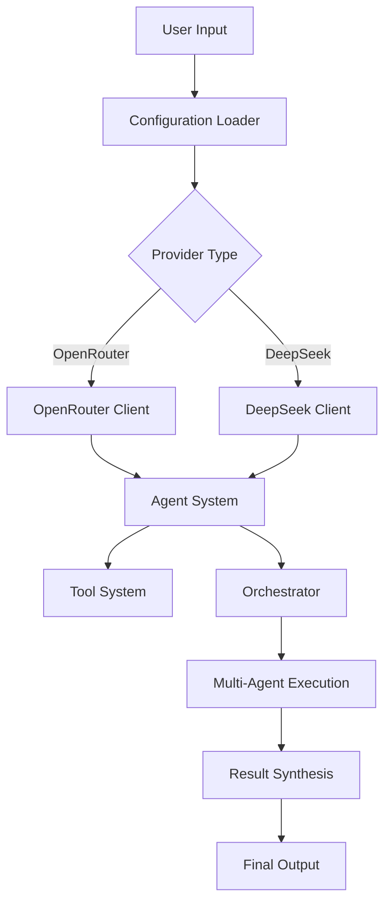
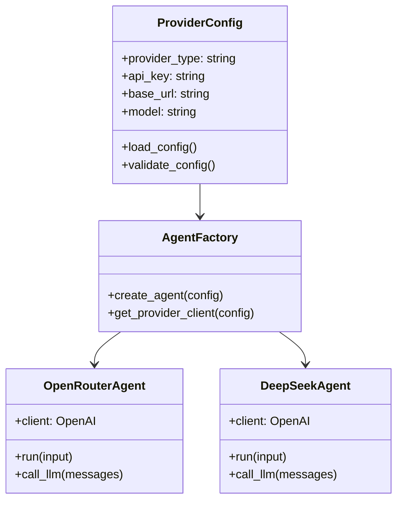

# Design Document

## Overview

The DeepSeek integration will extend the Make It Heavy framework to support DeepSeek API as an alternative to OpenRouter. The design leverages DeepSeek's OpenAI-compatible API format, requiring minimal code changes while providing significant cost savings. The integration will be implemented through configuration-driven provider selection, maintaining backward compatibility and allowing users to easily switch between providers.

## Architecture

### High-Level Architecture



### Provider Abstraction Layer

The design introduces a provider abstraction that allows seamless switching between OpenRouter and DeepSeek without code changes:



## Components and Interfaces

### 1. Configuration System

#### Enhanced Configuration Structure
```yaml
# Provider selection
provider:
  type: "deepseek"  # or "openrouter"
  
# DeepSeek-specific configuration
deepseek:
  api_key: "YOUR_DEEPSEEK_API_KEY"
  base_url: "https://api.deepseek.com"
  model: "deepseek-chat"  # or "deepseek-reasoner"

# OpenRouter configuration (existing)
openrouter:
  api_key: "YOUR_OPENROUTER_API_KEY"
  base_url: "https://openrouter.ai/api/v1"
  model: "openai/gpt-4.1-mini"
```

#### Configuration Loader Interface
```python
class ConfigurationManager:
    def load_config(self, config_path: str) -> dict
    def get_provider_config(self) -> dict
    def validate_provider_config(self, provider_type: str) -> bool
    def get_active_provider(self) -> str
```

### 2. Provider Client Factory

#### Client Factory Interface
```python
class ProviderClientFactory:
    @staticmethod
    def create_client(provider_config: dict) -> OpenAI:
        """Creates appropriate OpenAI client for the specified provider"""
        
    @staticmethod
    def get_supported_providers() -> List[str]:
        """Returns list of supported providers"""
        
    @staticmethod
    def validate_provider_config(provider_type: str, config: dict) -> bool:
        """Validates provider-specific configuration"""
```

### 3. Enhanced Agent System

#### Base Agent Interface
```python
class BaseAgent:
    def __init__(self, config_path: str, silent: bool = False)
    def run(self, user_input: str) -> str
    def call_llm(self, messages: List[dict]) -> Any
    def handle_tool_call(self, tool_call: Any) -> dict
    def get_provider_info(self) -> dict
```

#### Provider-Specific Implementations
```python
class UniversalAgent(BaseAgent):
    """Universal agent that works with any OpenAI-compatible provider"""
    def __init__(self, config_path: str, silent: bool = False):
        self.config = ConfigurationManager().load_config(config_path)
        self.provider_type = self.config['provider']['type']
        self.client = ProviderClientFactory.create_client(
            self.config[self.provider_type]
        )
```

### 4. CLI Enhancement

#### Provider-Aware CLI Interface
```python
class ProviderAwareCLI:
    def __init__(self, config_path: str = None, provider: str = None)
    def display_provider_info(self) -> None
    def run_interactive_mode(self) -> None
    def handle_provider_switching(self, new_provider: str) -> None
```

## Data Models

### Provider Configuration Model
```python
@dataclass
class ProviderConfig:
    provider_type: str
    api_key: str
    base_url: str
    model: str
    additional_params: Dict[str, Any] = field(default_factory=dict)
    
    def validate(self) -> bool:
        """Validates the configuration for the specific provider"""
        
    def to_openai_config(self) -> Dict[str, str]:
        """Converts to OpenAI client configuration format"""
```

### Model Information Model
```python
@dataclass
class ModelInfo:
    name: str
    provider: str
    context_window: int
    supports_function_calling: bool
    supports_json_output: bool
    cost_per_1m_input_tokens: float
    cost_per_1m_output_tokens: float
    special_features: List[str] = field(default_factory=list)
```

## Error Handling

### Provider-Specific Error Handling

#### Error Classification
```python
class ProviderError(Exception):
    """Base class for provider-specific errors"""
    pass

class DeepSeekAPIError(ProviderError):
    """DeepSeek-specific API errors"""
    pass

class OpenRouterAPIError(ProviderError):
    """OpenRouter-specific API errors"""
    pass

class ConfigurationError(ProviderError):
    """Configuration-related errors"""
    pass
```

#### Error Handling Strategy
1. **API Errors**: Catch and translate provider-specific errors to user-friendly messages
2. **Configuration Errors**: Validate configuration at startup and provide clear guidance
3. **Rate Limiting**: Implement exponential backoff for both providers
4. **Fallback Strategy**: Option to fallback to alternative provider if configured

### Error Recovery Mechanisms
```python
class ErrorRecoveryManager:
    def handle_api_error(self, error: Exception, provider: str) -> str
    def suggest_configuration_fix(self, error: ConfigurationError) -> str
    def implement_rate_limit_backoff(self, provider: str) -> None
```

## Testing Strategy

### Unit Testing Approach

#### Configuration Testing
- Test configuration loading for both providers
- Validate configuration validation logic
- Test provider switching functionality

#### Provider Client Testing
- Mock API responses for both OpenRouter and DeepSeek
- Test function calling compatibility
- Verify error handling for each provider

#### Integration Testing
- End-to-end testing with both providers
- Multi-agent orchestration testing
- Tool integration testing

### Test Structure
```
tests/
├── unit/
│   ├── test_configuration.py
│   ├── test_provider_factory.py
│   ├── test_deepseek_agent.py
│   └── test_error_handling.py
├── integration/
│   ├── test_single_agent_deepseek.py
│   ├── test_multi_agent_deepseek.py
│   └── test_provider_switching.py
└── fixtures/
    ├── config_deepseek.yaml
    ├── config_openrouter.yaml
    └── mock_responses.json
```

### Testing Scenarios

#### Core Functionality Tests
1. **Single Agent Mode**: Test basic question-answering with DeepSeek
2. **Multi-Agent Mode**: Test parallel execution with DeepSeek
3. **Function Calling**: Test tool usage with both DeepSeek models
4. **Provider Switching**: Test switching between providers without restart

#### Edge Case Tests
1. **API Failures**: Test graceful handling of API errors
2. **Rate Limiting**: Test backoff strategies
3. **Invalid Configuration**: Test configuration validation
4. **Network Issues**: Test timeout and retry mechanisms

## Implementation Phases

### Phase 1: Core Infrastructure
- Implement configuration management system
- Create provider client factory
- Add basic DeepSeek agent support

### Phase 2: Feature Parity
- Ensure all existing features work with DeepSeek
- Implement error handling and recovery
- Add provider-aware CLI enhancements

### Phase 3: Advanced Features
- Add cost tracking and optimization features
- Implement provider performance comparison tools
- Add documentation and examples

### Phase 4: Testing and Optimization
- Comprehensive testing suite
- Performance optimization
- User experience improvements

## Security Considerations

### API Key Management
- Secure storage of API keys in configuration
- Environment variable support for sensitive data
- Clear documentation on API key security best practices

### Data Privacy
- Ensure no sensitive data is logged
- Respect provider-specific data handling policies
- Implement proper request/response sanitization

## Performance Considerations

### Cost Optimization
- Implement token usage tracking
- Provide cost comparison between providers
- Support for DeepSeek's off-peak pricing optimization

### Response Time Optimization
- Connection pooling for API clients
- Efficient request batching where possible
- Caching strategies for repeated requests

## Migration Strategy

### Backward Compatibility
- Existing OpenRouter configurations continue to work unchanged
- Gradual migration path for users wanting to switch
- Clear migration documentation and tools

### Configuration Migration
```python
class ConfigMigrator:
    def migrate_to_universal_config(self, old_config_path: str) -> str
    def create_deepseek_config_template(self) -> str
    def validate_migrated_config(self, config_path: str) -> bool
```