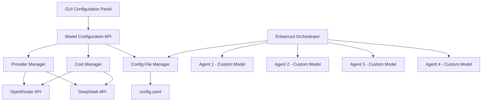
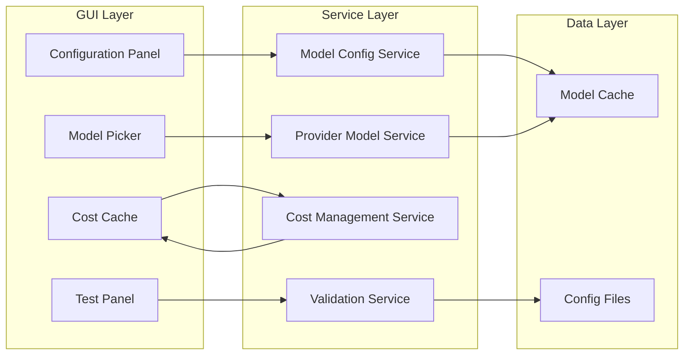

# Design Document

## Overview

System konfiguracji wielu modeli dla Make It Heavy składa się z trzech głównych komponentów:
1. **Backend API Service** - zarządzanie konfiguracją i pobieranie danych o modelach
2. **GUI Configuration Panel** - interfejs użytkownika do konfiguracji modeli
3. **Enhanced Orchestrator** - zmodyfikowany orkiestrator obsługujący różne modele per agent

System wykorzystuje istniejącą architekturę Make It Heavy, rozszerzając ją o możliwość przypisania różnych modeli do poszczególnych agentów z pełną transparencją kosztów i kompatybilności.

## Architecture

### High-Level Architecture



### Component Architecture



## Components and Interfaces

### 1. Model Configuration API

**Purpose:** Centralne API do zarządzania konfiguracją modeli

**Key Classes:**
- `ModelConfigurationManager` - główny manager konfiguracji
- `ProviderModelService` - obsługa dostawców modeli
- `CostCalculationService` - kalkulacja kosztów
- `ModelValidationService` - walidacja kompatybilności

**Key Methods:**
```python
class ModelConfigurationManager:
    def get_available_models(provider: str) -> List[ModelInfo]
    def get_model_costs(model_id: str) -> CostInfo
    def validate_model_compatibility(model_id: str) -> bool
    def save_agent_configuration(config: AgentModelConfig) -> bool
    def load_agent_configuration() -> AgentModelConfig
    def test_model_configuration(config: AgentModelConfig) -> TestResults
```

### 2. GUI Configuration Panel

**Purpose:** Interfejs użytkownika do konfiguracji modeli

**Key Components:**
- `MultiModelConfigPanel` - główny panel konfiguracji
- `AgentModelSelector` - selektor modelu dla pojedynczego agenta
- `ModelInfoWidget` - widget z informacjami o modelu
- `CostCalculatorWidget` - kalkulator kosztów
- `ConfigurationProfileManager` - zarządzanie profilami

**GUI Layout:**
```
┌─────────────────────────────────────────────────────────────┐
│ Multi-Model Configuration                                   │
├─────────────────────────────────────────────────────────────┤
│ Profile: [Budget ▼] [Balanced] [Premium] [Custom]          │
├─────────────────────────────────────────────────────────────┤
│ Agent 1 (Research)     │ Agent 2 (Analysis)                │
│ Model: [Claude 3.5 ▼]  │ Model: [GPT-4o-mini ▼]            │
│ Cost: $3.00/1M in      │ Cost: $0.15/1M in                 │
│       $15.00/1M out    │       $0.60/1M out                │
├─────────────────────────────────────────────────────────────┤
│ Agent 3 (Verification) │ Agent 4 (Alternatives)            │
│ Model: [Gemini Flash ▼]│ Model: [Llama 3.1-70B ▼]          │
│ Cost: $0.075/1M in     │ Cost: $0.40/1M in                 │
│       $0.30/1M out     │       $0.40/1M out                │
├─────────────────────────────────────────────────────────────┤
│ Total Estimated Cost: $2.15 per query                      │
├─────────────────────────────────────────────────────────────┤
│ [Test Config] [Save] [Reset] [Export] [Import]             │
└─────────────────────────────────────────────────────────────┘
```

### 3. Enhanced Orchestrator

**Purpose:** Zmodyfikowany orkiestrator obsługujący różne modele per agent

**Key Changes:**
- Rozszerzenie `TaskOrchestrator` o obsługę konfiguracji per-agent
- Modyfikacja `run_agent_parallel` do tworzenia agentów z różnymi modelami
- Dodanie logowania użytych modeli i kosztów

## Data Models

### ModelInfo
```python
@dataclass
class ModelInfo:
    id: str
    name: str
    provider: str
    supports_function_calling: bool
    context_window: int
    input_cost_per_1m: float
    output_cost_per_1m: float
    description: str
    capabilities: List[str]
```

### AgentModelConfig
```python
@dataclass
class AgentModelConfig:
    agent_0_model: str
    agent_1_model: str  
    agent_2_model: str
    agent_3_model: str
    synthesis_model: str
    default_model: str
    profile_name: str
```

### CostEstimate
```python
@dataclass
class CostEstimate:
    total_input_tokens: int
    total_output_tokens: int
    total_cost: float
    per_agent_costs: Dict[int, float]
    breakdown: Dict[str, float]
```

## Error Handling

### Model Availability Errors
- **ModelNotAvailableError** - gdy model nie jest dostępny u dostawcy
- **ModelNotCompatibleError** - gdy model nie obsługuje function calling
- **ProviderConnectionError** - problemy z połączeniem do API dostawcy

### Configuration Errors  
- **InvalidConfigurationError** - nieprawidłowa konfiguracja modeli
- **ConfigurationSaveError** - błąd zapisu konfiguracji
- **ModelValidationError** - błąd walidacji modelu

### Cost Calculation Errors
- **CostDataUnavailableError** - brak danych o kosztach
- **CostCalculationError** - błąd w kalkulacji kosztów

## Testing Strategy

### Unit Tests
- Test każdego komponentu API osobno
- Mock'owanie wywołań do zewnętrznych API
- Testowanie różnych scenariuszy błędów
- Walidacja kalkulacji kosztów

### Integration Tests  
- Test pełnego flow konfiguracji modeli
- Test integracji GUI z backend API
- Test orkiestratora z różnymi modelami
- Test importu/eksportu konfiguracji

### End-to-End Tests
- Test kompletnego scenariusza użytkownika
- Test wszystkich profili konfiguracji
- Test funkcji testowania konfiguracji
- Performance testy z różnymi modelami
##
# Manual Tests
- Test GUI responsywności i użyteczności
- Test różnych kombinacji modeli
- Test scenariuszy edge case
- Test kompatybilności z istniejącymi konfiguracjami

## Implementation Phases

### Phase 1: Backend API Foundation
- Implementacja `ModelConfigurationManager`
- Integracja z istniejącymi dostawcami API
- Podstawowa walidacja modeli i kosztów
- Rozszerzenie systemu konfiguracji YAML

### Phase 2: Cost Management System
- Implementacja `CostCalculationService`
- Cache'owanie danych o kosztach
- Kalkulacja szacunkowych kosztów
- Monitoring rzeczywistych kosztów

### Phase 3: GUI Implementation
- Stworzenie panelu konfiguracji
- Implementacja selektorów modeli
- Integracja z backend API
- Podstawowe profile konfiguracji

### Phase 4: Enhanced Orchestrator
- Modyfikacja `TaskOrchestrator`
- Obsługa różnych modeli per agent
- Logowanie użytych modeli
- Raportowanie kosztów

### Phase 5: Advanced Features
- Import/eksport konfiguracji
- Testowanie konfiguracji
- Zaawansowane profile
- Optymalizacja wydajności

## Security Considerations

### API Key Management
- Bezpieczne przechowywanie kluczy API
- Szyfrowanie wrażliwych danych w eksportowanych konfiguracjach
- Walidacja uprawnień dostępu do modeli

### Data Privacy
- Nie logowanie zawartości zapytań
- Anonimizacja danych w raportach kosztów
- Zgodność z politykami prywatności dostawców

### Configuration Security
- Walidacja importowanych konfiguracji
- Ochrona przed injection attacks
- Bezpieczne parsowanie plików YAML

## Performance Considerations

### Caching Strategy
- Cache informacji o modelach (TTL: 1 godzina)
- Cache danych o kosztach (TTL: 24 godziny)
- Lazy loading GUI komponentów

### API Rate Limiting
- Respektowanie limitów API dostawców
- Implementacja retry logic z exponential backoff
- Batch'owanie zapytań o informacje o modelach

### Memory Management
- Efektywne zarządzanie pamięcią w GUI
- Cleanup nieużywanych obiektów modeli
- Optymalizacja wielkości cache'u

## Monitoring and Observability

### Metrics
- Liczba konfiguracji modeli per użytkownik
- Najpopularniejsze kombinacje modeli
- Średnie koszty per zapytanie
- Częstotliwość błędów API

### Logging
- Logi zmian konfiguracji
- Logi błędów walidacji modeli
- Logi kosztów rzeczywistych vs szacunkowych
- Performance logi GUI

### Alerting
- Alerty przy przekroczeniu budżetu kosztów
- Alerty przy niedostępności modeli
- Alerty przy błędach konfiguracji