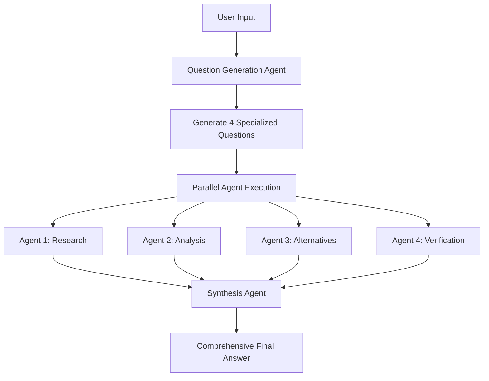

# 🚀 Make It Heavy

A Python framework to emulate **Grok heavy** functionality using a powerful multi-agent system. Built with support for both OpenRouter and DeepSeek APIs, Make It Heavy delivers comprehensive, multi-perspective analysis through intelligent agent orchestration at competitive costs.

## 🌟 Features

- **🧠 Grok Heavy Emulation**: Multi-agent system that delivers deep, comprehensive analysis like Grok heavy mode
- **🔀 Parallel Intelligence**: Deploy 4 specialized agents simultaneously for maximum insight coverage
- **🎯 Dynamic Question Generation**: AI creates custom research questions tailored to each query
- **⚡ Real-time Orchestration**: Live visual feedback during multi-agent execution
- **🛠️ Hot-Swappable Tools**: Automatically discovers and loads tools from the `tools/` directory
- **🔄 Intelligent Synthesis**: Combines multiple agent perspectives into unified, comprehensive answers
- **🎮 Single Agent Mode**: Run individual agents for simpler tasks with full tool access
- **💰 Multi-Provider Support**: Choose between OpenRouter and DeepSeek for optimal cost and performance
- **🚀 DeepSeek Integration**: Access to DeepSeek-V3 and DeepSeek-R1 models with significant cost savings
- **⚙️ Easy Provider Switching**: Switch between providers with simple configuration changes

## 🚀 Quick Start

### Prerequisites

- Python 3.8+
- [uv](https://github.com/astral-sh/uv) (recommended Python package manager)
- API key for your chosen provider:
  - **OpenRouter API key** (for OpenRouter models)
  - **DeepSeek API key** (for DeepSeek models - significantly cheaper option)

### Installation

1. **Clone and setup environment:**
```bash
git clone <https://github.com/Doriandarko/make-it-heavy.git>
cd "make it heavy"

# Create virtual environment with uv
uv venv

# Activate virtual environment
source .venv/bin/activate  # On Windows: .venv\Scripts\activate
```

2. **Install dependencies:**
```bash
uv pip install -r requirements.txt
```

**For GUI support (recommended):**
```bash
# GUI dependencies are included in requirements.txt
# Additional system dependencies may be needed:

# macOS (if using Homebrew)
brew install python-tk

# Ubuntu/Debian
sudo apt-get install python3-tk

# Windows (usually included with Python)
# No additional installation needed
```

3. **Configure your provider:**

**Option A: OpenRouter (Default)**
```bash
# Edit config.yaml and replace YOUR API KEY HERE with your OpenRouter API key
```

**Option B: DeepSeek (Recommended for cost savings)**
```bash
# Use the DeepSeek configuration file
cp config_deepseek.yaml config.yaml
# Edit config.yaml and add your DeepSeek API key
```

**Option C: DeepSeek Reasoner (For complex reasoning tasks)**
```bash
# Use the DeepSeek Reasoner configuration file  
cp config_deepseek_reasoner.yaml config.yaml
# Edit config.yaml and add your DeepSeek API key
```

## 🎯 Usage

### 🖥️ GUI Mode (Recommended)

Launch the modern graphical interface for the best user experience:

```bash
python gui/main_app.py
```

📖 **Detailed GUI Documentation:**
- **[GUI Installation Guide](GUI_INSTALLATION.md)** - Complete installation instructions for all platforms
- **[GUI User Guide](GUI_USER_GUIDE.md)** - Comprehensive usage guide with screenshots and examples

**🎨 Modern GUI Features:**
- **🖼️ Native Interface**: Clean, modern Tkinter-based design optimized for desktop use
- **🌓 Smart Theming**: Automatic dark/light theme detection with macOS system integration
- **💬 Interactive Chat**: Real-time conversation interface with message history and typing indicators
- **⚙️ Visual Configuration**: Intuitive settings panels for API keys, models, and preferences
- **🔄 Multi-Provider Support**: Easy switching between OpenRouter, DeepSeek, and other providers
- **🤖 Agent Orchestration**: Visual controls for single and multi-agent execution modes
- **📊 Live Progress Tracking**: Real-time progress bars and status updates during multi-agent sessions
- **💾 Session Management**: Save, load, and organize conversation sessions with persistent history
- **🎛️ Advanced Controls**: Fine-tune agent parameters, timeout settings, and orchestration options
- **📱 Responsive Design**: Adaptive layout that works on different screen sizes
- **🔧 Multi-Model Configuration**: Visual interface for comparing and configuring different AI models
- **💰 Cost Monitoring**: Real-time cost tracking and usage analytics
- **🎯 Agent Templates**: Pre-configured agent setups for different use cases

**🧩 GUI Components:**

**Main Application (`gui/main_app.py`)**
- Central hub with tabbed interface for different modes
- Integrated menu system with keyboard shortcuts
- Status bar with real-time system information
- Window state persistence and restoration

**Chat Interface (`gui/chat_interface.py`)**
- Rich text conversation display with syntax highlighting
- Message threading and conversation branching
- Export conversations to various formats (Markdown, JSON, TXT)
- Search and filter conversation history

**Settings Panel (`gui/settings_panel.py`)**
- Visual API key management with validation
- Model selection with real-time cost estimates
- Provider switching with automatic configuration migration
- Advanced parameter tuning with tooltips and help text

**Agent Manager (`gui/agent_manager.py`)**
- Single agent mode with tool selection
- Multi-agent orchestration with parallel execution monitoring
- Custom agent configuration and role assignment
- Real-time agent status and performance metrics

**Multi-Model Configuration (`gui/multi_model_config_panel.py`)**
- Visual model comparison with cost and performance metrics
- Provider-specific model recommendations
- Batch configuration for different use cases
- Model performance benchmarking and testing

**Session Manager (`gui/session_manager.py`)**
- Conversation organization with tags and categories
- Session templates for common workflows
- Backup and restore functionality
- Cross-session search and analytics

**Theme Manager (`gui/theme_manager.py`)**
- Automatic system theme detection (macOS, Windows, Linux)
- Custom theme creation and sharing
- Accessibility options (high contrast, large fonts)
- Theme scheduling (day/night modes)

**🚀 GUI Quick Start:**

1. **Launch GUI**: `python gui/main_app.py`
2. **Configure Provider**: Go to Settings → API Configuration
3. **Select Model**: Choose your preferred provider and model
4. **Start Chatting**: Use the chat interface for single agent conversations
5. **Try Multi-Agent**: Switch to Agent Manager for Grok Heavy mode
6. **Save Sessions**: Use Session Manager to organize your conversations
7. **Monitor Costs**: Check the Cost Monitor tab for usage analytics
8. **Configure Models**: Use Multi-Model Config for advanced model management

**💡 GUI Tips:**
- Use `Cmd+N` (macOS) or `Ctrl+N` (Windows/Linux) for new conversations
- Press `Cmd+,` or `Ctrl+,` to quickly access settings
- Use `Cmd+Shift+M` or `Ctrl+Shift+M` to toggle multi-agent mode
- Right-click messages for context menu options (copy, export, etc.)
- Drag and drop files into chat for file analysis
- Use the status bar to monitor real-time API usage and costs
- Access quick model switching via the toolbar dropdown

**🎮 GUI Interface Modes:**

**1. Chat Mode** - Interactive conversations with single agents
- Real-time message streaming
- Syntax highlighting for code responses
- Message history with search functionality
- Export conversations to multiple formats

**2. Multi-Agent Mode** - Grok Heavy orchestration with visual feedback
- Live progress tracking for all 4 agents
- Individual agent status monitoring
- Parallel execution visualization
- Synthesis process display

**3. Settings Mode** - Comprehensive configuration management
- API key validation and testing
- Model performance comparison
- Provider switching with migration assistance
- Advanced parameter tuning

**4. Session Management** - Conversation organization and persistence
- Session categorization and tagging
- Cross-session search capabilities
- Backup and restore functionality
- Usage analytics and insights

**5. Cost Monitor** - Real-time usage tracking and optimization
- Token usage breakdown by provider
- Cost projections and budgeting
- Off-peak hour optimization suggestions
- Historical usage analysis

### Single Agent Mode (CLI)

Run a single intelligent agent with full tool access:

```bash
uv run main.py
```

**What it does:**
- Loads a single agent with all available tools
- Processes your query step-by-step
- Uses tools like web search, calculator, file operations
- Returns comprehensive response when task is complete

**Example:**
```
User: Research the latest developments in AI and summarize them
Agent: [Uses search tool, analyzes results, provides summary]
```

### Grok Heavy Mode (CLI)

Emulate Grok heavy's deep analysis with 4 parallel intelligent agents:

```bash
uv run make_it_heavy.py
```

**How Make It heavy works:**
1. **🎯 AI Question Generation**: Creates 4 specialized research questions from your query
2. **🔀 Parallel Intelligence**: Runs 4 agents simultaneously with different analytical perspectives
3. **⚡ Live Progress**: Shows real-time agent status with visual progress bars
4. **🔄 Intelligent Synthesis**: Combines all perspectives into one comprehensive Grok heavy-style answer

**Example Flow:**
```
User Query: "Who is Pietro Schirano?"

AI Generated Questions:
- Agent 1: "Research Pietro Schirano's professional background and career history"
- Agent 2: "Analyze Pietro Schirano's achievements and contributions to technology"  
- Agent 3: "Find alternative perspectives on Pietro Schirano's work and impact"
- Agent 4: "Verify and cross-check information about Pietro Schirano's current role"

Result: Grok heavy-style comprehensive analysis combining all agent perspectives
```

## 💰 Provider Selection & Cost Comparison

Make It Heavy supports multiple AI providers to give you flexibility in cost and performance. Choose the provider that best fits your needs:

### 🏆 Recommended: DeepSeek (Best Value)

**DeepSeek-V3 (deepseek-chat)**
- **Cost**: $0.14 per 1M input tokens, $0.28 per 1M output tokens
- **Off-peak**: $0.07 per 1M input tokens, $0.14 per 1M output tokens (50% discount)
- **Best for**: General purpose tasks, multi-agent orchestration, daily use
- **Strengths**: Excellent cost-performance ratio, fast responses, function calling
- **Context**: 64K tokens

**DeepSeek-R1 (deepseek-reasoner)**  
- **Cost**: $0.55 per 1M input tokens, $2.19 per 1M output tokens
- **Off-peak**: $0.275 per 1M input tokens, $1.095 per 1M output tokens (50% discount)
- **Best for**: Complex reasoning, mathematical problems, code analysis, research
- **Strengths**: Superior reasoning capabilities, detailed step-by-step thinking
- **Context**: 64K tokens

### 🔄 Alternative: OpenRouter

**GPT-4.1 Mini (via OpenRouter)**
- **Cost**: $0.15 per 1M input tokens, $0.60 per 1M output tokens  
- **Best for**: Balanced performance and cost
- **Strengths**: Reliable, well-tested, broad compatibility
- **Context**: 128K tokens

**Claude 3.5 Sonnet (via OpenRouter)**
- **Cost**: $3.00 per 1M input tokens, $15.00 per 1M output tokens
- **Best for**: Complex analysis, creative tasks, long documents
- **Strengths**: Excellent reasoning, 200K context window
- **Context**: 200K tokens

### 💡 Cost Savings Examples

**Typical Grok Heavy Session (4 agents, ~40K input + 10K output tokens):**
- **DeepSeek-V3**: $0.0084 per session (regular) / $0.0042 (off-peak)
- **GPT-4.1 Mini**: $0.0120 per session  
- **Claude 3.5 Sonnet**: $0.2700 per session

**Monthly usage (100 sessions):**
- **DeepSeek-V3**: $0.84/month (regular) / $0.42/month (off-peak)
- **GPT-4.1 Mini**: $1.20/month
- **Claude 3.5 Sonnet**: $27.00/month

**Annual savings with DeepSeek-V3 (vs Claude 3.5 Sonnet):**
- Regular hours: $314/year saved
- Off-peak hours: $319/year saved

### 🕐 DeepSeek Off-Peak Optimization

DeepSeek offers significant discounts during off-peak hours (11 PM - 7 AM Beijing time):

**Off-Peak Hours (Beijing Time):**
- **Start**: 11:00 PM (23:00)
- **End**: 7:00 AM (07:00)
- **Discount**: Up to 50% off regular pricing

**Time Zone Conversions:**
- **UTC**: 3:00 PM - 11:00 PM
- **EST**: 10:00 AM - 6:00 PM  
- **PST**: 7:00 AM - 3:00 PM
- **CET**: 4:00 PM - 12:00 AM

**Optimization Tips:**
- Schedule batch processing during off-peak hours
- Use DeepSeek-V3 for cost-sensitive workloads
- Reserve DeepSeek-R1 for complex reasoning tasks only

### 🚀 Getting Started with DeepSeek

1. **Get API Key**: Sign up at [platform.deepseek.com](https://platform.deepseek.com)
2. **Choose Configuration**: 
   - `config_deepseek.yaml` for general use (DeepSeek-V3)
   - `config_deepseek_reasoner.yaml` for complex reasoning (DeepSeek-R1)
3. **Update Config**: Add your API key to the chosen configuration file
4. **Start Saving**: Enjoy up to 90% cost savings compared to premium models

## 🏗️ Architecture

### GUI Architecture

```mermaid
graph TD
    A[Main App] --> B[Chat Interface]
    A --> C[Settings Panel]
    A --> D[Agent Manager]
    A --> E[Session Manager]
    A --> F[Multi-Model Config]
    A --> G[Cost Monitor]
    
    B --> H[Message Display]
    B --> I[Input Handler]
    B --> J[Response Streaming]
    
    C --> K[API Configuration]
    C --> L[Theme Management]
    C --> M[Provider Settings]
    
    D --> N[Single Agent Mode]
    D --> O[Multi-Agent Orchestration]
    D --> P[Progress Tracking]
    
    E --> Q[Session Storage]
    E --> R[Conversation History]
    E --> S[Export/Import]
    
    F --> T[Model Comparison]
    F --> U[Cost Analysis]
    F --> V[Performance Metrics]
    
    G --> W[Usage Tracking]
    G --> X[Cost Projections]
    G --> Y[Optimization Suggestions]
```



### Orchestration Flow



### Core Components

#### 1. Agent System (`agent.py`)
- **Self-contained**: Complete agent implementation with tool access
- **Agentic Loop**: Continues working until task completion
- **Tool Integration**: Automatic tool discovery and execution
- **Configurable**: Uses `config.yaml` for all settings

#### 2. Orchestrator (`orchestrator.py`)
- **Dynamic Question Generation**: AI creates specialized questions
- **Parallel Execution**: Runs multiple agents simultaneously  
- **Response Synthesis**: AI combines all agent outputs
- **Error Handling**: Graceful fallbacks and error recovery

#### 3. Tool System (`tools/`)
- **Auto-Discovery**: Automatically loads all tools from directory
- **Hot-Swappable**: Add new tools by dropping files in `tools/`
- **Standardized Interface**: All tools inherit from `BaseTool`

### Available Tools

| Tool | Purpose | Parameters |
|------|---------|------------|
| `search_web` | Web search with DuckDuckGo | `query`, `max_results` |
| `calculate` | Safe mathematical calculations | `expression` |
| `read_file` | Read file contents | `path`, `head`, `tail` |
| `write_file` | Create/overwrite files | `path`, `content` |
| `mark_task_complete` | Signal task completion | `task_summary`, `completion_message` |

## ⚙️ Configuration

### Provider Configuration Examples

**DeepSeek Configuration (Recommended)**
```yaml
# Provider selection
provider:
  type: "deepseek"

# DeepSeek API settings
deepseek:
  api_key: "YOUR_DEEPSEEK_API_KEY"
  base_url: "https://api.deepseek.com"
  model: "deepseek-chat"  # or "deepseek-reasoner"

# System prompt for the agent
system_prompt: |
  You are a helpful research assistant...

# Agent settings
agent:
  max_iterations: 10

# Orchestrator settings
orchestrator:
  parallel_agents: 4
  task_timeout: 300  # 450 for reasoner model
  aggregation_strategy: "consensus"
```

**OpenRouter Configuration (Legacy Format)**
```yaml
# OpenRouter API settings
openrouter:
  api_key: "YOUR_OPENROUTER_API_KEY"
  base_url: "https://openrouter.ai/api/v1"
  model: "openai/gpt-4.1-mini"

# System prompt for the agent
system_prompt: |
  You are a helpful research assistant...

# Agent settings
agent:
  max_iterations: 10

# Orchestrator settings
orchestrator:
  parallel_agents: 4
  task_timeout: 300
  aggregation_strategy: "consensus"
```

### Command-Line Configuration Selection

You can specify different configuration files at runtime without modifying your main config:

```bash
# Single agent mode with different providers
uv run main.py --config config_deepseek.yaml           # DeepSeek general use
uv run main.py --config config_deepseek_reasoner.yaml  # DeepSeek reasoning
uv run main.py --config config.yaml                    # Default/OpenRouter

# Multi-agent mode with different providers  
uv run make_it_heavy.py --config config_deepseek.yaml           # Cost-effective
uv run make_it_heavy.py --config config_deepseek_reasoner.yaml  # Complex analysis
uv run make_it_heavy.py --config config.yaml                    # Default/OpenRouter

# Examples for different use cases
uv run main.py --config config_deepseek.yaml           # Daily tasks
uv run make_it_heavy.py --config config_deepseek_reasoner.yaml  # Research projects
```

**Configuration File Naming Convention:**
- `config.yaml` - Default configuration (currently OpenRouter)
- `config_deepseek.yaml` - DeepSeek-V3 for general purpose
- `config_deepseek_reasoner.yaml` - DeepSeek-R1 for complex reasoning
- `config_openrouter.yaml` - OpenRouter backup (create manually)

### Model Selection Guide

**DeepSeek Models:**
```yaml
deepseek:
  model: "deepseek-chat"      # DeepSeek-V3: Fast, cost-effective, general purpose
  model: "deepseek-reasoner"  # DeepSeek-R1: Advanced reasoning, higher cost
```

**OpenRouter Models:**
```yaml
openrouter:
  model: "openai/gpt-4.1-mini"             # Balanced cost/performance
  model: "anthropic/claude-3.5-sonnet"     # Premium reasoning
  model: "google/gemini-2.0-flash-001"     # Speed optimized
  model: "meta-llama/llama-3.1-70b"        # Open source option
```

## 🔧 Development

### Adding New Tools

1. Create a new file in `tools/` directory
2. Inherit from `BaseTool`
3. Implement required methods:

```python
from .base_tool import BaseTool

class MyCustomTool(BaseTool):
    @property
    def name(self) -> str:
        return "my_tool"
    
    @property
    def description(self) -> str:
        return "Description of what this tool does"
    
    @property
    def parameters(self) -> dict:
        return {
            "type": "object",
            "properties": {
                "param": {"type": "string", "description": "Parameter description"}
            },
            "required": ["param"]
        }
    
    def execute(self, param: str) -> dict:
        # Tool implementation
        return {"result": "success"}
```

4. The tool will be automatically discovered and loaded!

### Customizing Models

**DeepSeek Models:**
```yaml
deepseek:
  model: "deepseek-chat"      # DeepSeek-V3: Best cost/performance ratio
  model: "deepseek-reasoner"  # DeepSeek-R1: Advanced reasoning capabilities
```

**OpenRouter Models:**
```yaml
openrouter:
  model: "anthropic/claude-3.5-sonnet"     # Premium reasoning
  model: "openai/gpt-4.1-mini"             # Balanced cost/performance  
  model: "google/gemini-2.0-flash-001"     # Speed optimized
  model: "meta-llama/llama-3.1-70b"        # Open source option
```

### Provider System Architecture

The new provider system supports multiple AI providers through a unified interface:

```python
# Configuration Manager
from config_manager import ConfigurationManager
config = ConfigurationManager().load_config('config.yaml')

# Provider Factory
from provider_factory import ProviderClientFactory
client = ProviderClientFactory.create_client(config)

# Universal Agent
from agent import UniversalAgent
agent = UniversalAgent('config.yaml')
```

### Adjusting Agent Count

Change number of parallel agents:

```yaml
orchestrator:
  parallel_agents: 6  # Run 6 agents instead of 4
```

**Note**: Make sure your OpenRouter plan supports the concurrent usage!

## 🎮 Examples

### GUI Workflow Examples

**Research Query via GUI:**
```
1. Launch GUI: python gui/main_app.py
2. Navigate to Chat tab
3. Enter: "Analyze the impact of AI on software development in 2024"
4. Watch real-time response streaming with syntax highlighting
5. Switch to Multi-Agent tab for Grok Heavy analysis
6. Monitor progress bars as 4 agents work in parallel
7. View synthesized comprehensive analysis
8. Save session for future reference
```

**Model Comparison via GUI:**
```
1. Open Multi-Model Config tab
2. Select models to compare (e.g., DeepSeek-V3 vs GPT-4.1 Mini)
3. View cost analysis and performance metrics
4. Test both models with sample queries
5. Choose optimal model based on results
6. Apply configuration with one click
```

**Cost Optimization via GUI:**
```
1. Open Cost Monitor tab
2. Review usage patterns and spending
3. Identify high-cost operations
4. Get optimization suggestions (e.g., use off-peak hours)
5. Set budget alerts and limits
6. Track savings over time
```

### CLI Examples

### Research Query
```bash
User: "Analyze the impact of AI on software development in 2024"

Single Agent: Comprehensive research report
Grok heavy Mode: 4 specialized perspectives combined into deep, multi-faceted analysis
```

### Technical Question  
```bash
User: "How do I optimize a React application for performance?"

Single Agent: Step-by-step optimization guide
Grok heavy Mode: Research + Analysis + Alternatives + Verification = Complete expert guide
```

### Creative Task
```bash
User: "Create a business plan for an AI startup"

Single Agent: Structured business plan
Grok heavy Mode: Market research + Financial analysis + Competitive landscape + Risk assessment
```

## 🛠️ Troubleshooting

### Common Issues

**API Key Errors:**
```
Error: Invalid API key
Solution: 
- OpenRouter: Update config.yaml with valid OpenRouter API key
- DeepSeek: Ensure your DeepSeek API key is correctly set in deepseek.api_key
- Check that your API key has sufficient credits/quota
```

**Provider Configuration Issues:**
```
Error: Provider 'deepseek' not found
Solution: Ensure provider.type is set correctly in config.yaml:
  provider:
    type: "deepseek"  # or "openrouter"
```

**DeepSeek-Specific Issues:**

**Connection Errors:**
```
Error: Connection failed to DeepSeek API
Solution: 
- Verify base_url is set to "https://api.deepseek.com"
- Check your internet connection
- Ensure DeepSeek API is not experiencing downtime
```

**Model Not Found:**
```
Error: Model 'deepseek-chat' not found
Solution: Use correct model names:
- "deepseek-chat" for DeepSeek-V3
- "deepseek-reasoner" for DeepSeek-R1
```

**Rate Limiting:**
```
Error: Rate limit exceeded
Solution:
- DeepSeek has generous rate limits, but check your usage
- Implement delays between requests if needed
- Consider using off-peak hours for better rates
```

**Function Calling Issues:**
```
Error: Invalid 'tools': empty array
Solution:
- This error occurs when DeepSeek receives an empty tools array
- Fixed in the latest version by adding a dummy tool in the agent.run() method
- If you see this error, update to the latest version of the code
- Affects mainly the multi-agent synthesis process

Error: Function calling not working with DeepSeek
Solution:
- Both DeepSeek models support function calling
- Ensure your API key has function calling permissions
- Check that tools are properly formatted
```

**OpenRouter-Specific Issues:**

**Model Access Denied:**
```
Error: Model access denied
Solution:
- Check if your OpenRouter plan includes the requested model
- Some models require higher tier subscriptions
- Verify model name is correct (e.g., "openai/gpt-4.1-mini")
```

**Credit/Balance Issues:**
```
Error: Insufficient credits
Solution:
- Check your OpenRouter balance at openrouter.ai
- Add credits to your account
- Consider switching to DeepSeek for lower costs
```

### Provider Switching Issues

**Configuration Conflicts:**
```
Error: Multiple providers configured
Solution: Ensure only one provider section is active:
# Correct - only one provider configured
provider:
  type: "deepseek"
deepseek:
  api_key: "your_key"
# Don't include openrouter section when using DeepSeek
```

**Migration Problems:**
```
Error: Old configuration format detected
Solution: Update to new universal configuration format:
# Old format (deprecated)
openrouter:
  api_key: "key"

# New format (recommended)
provider:
  type: "openrouter"
openrouter:
  api_key: "key"
```

### Performance Issues

**Slow Response Times:**
```
Issue: DeepSeek responses are slow
Solution:
- DeepSeek-V3 is typically faster than DeepSeek-R1
- Use off-peak hours for potentially better performance
- Check your network connection
- Consider reducing parallel_agents if experiencing timeouts
```

**Timeout Issues:**
```
Agent timeout errors
Solution: 
- Increase task_timeout in config.yaml (default: 300 seconds)
- DeepSeek-R1 may need longer timeouts due to reasoning process
- Reduce parallel_agents for complex tasks
```

### GUI-Specific Issues

**GUI Won't Start:**
```
Error: No module named 'tkinter'
Solution:
- macOS: brew install python-tk
- Ubuntu/Debian: sudo apt-get install python3-tk
- Windows: Reinstall Python with tkinter support
```

**Theme Issues:**
```
Error: Theme not loading correctly
Solution:
- Check system theme settings
- Reset theme to default in Settings → Appearance
- Clear theme cache: rm -rf ~/.make_it_heavy/themes/cache
```

**Session Management Issues:**
```
Error: Cannot save/load sessions
Solution:
- Check write permissions in project directory
- Verify .kiro/sessions/ directory exists
- Clear corrupted sessions: rm -rf .kiro/sessions/*.json
```

**GUI Performance Issues:**
```
Issue: GUI feels slow or unresponsive
Solution:
- Reduce message history limit in settings
- Disable real-time syntax highlighting for large responses
- Close unused tabs to free memory
- Check system resources (RAM, CPU usage)
```

### Debug Mode

Enable detailed debugging for troubleshooting:

```python
# In main.py or make_it_heavy.py
agent = UniversalAgent(config_path, silent=False)  # Enable debug output
```

**GUI Debug Mode:**
```bash
# Launch GUI with debug logging
python gui/main_app.py --debug

# Or set environment variable
export MAKE_IT_HEAVY_DEBUG=1
python gui/main_app.py
```

**Debug Configuration:**
```yaml
# Add to config.yaml for verbose logging
debug:
  enabled: true
  log_requests: true
  log_responses: true
```

### Getting Help

**Check Provider Status:**
- DeepSeek: [status.deepseek.com](https://status.deepseek.com)
- OpenRouter: [status.openrouter.ai](https://status.openrouter.ai)

**Community Support:**
- GitHub Issues: Report bugs and get help
- Provider Documentation: 
  - [DeepSeek API Docs](https://platform.deepseek.com/api-docs)
  - [OpenRouter API Docs](https://openrouter.ai/docs)

**Quick Diagnostic:**
```bash
# Test your configuration
python -c "
from config_manager import ConfigurationManager
from provider_factory import ProviderClientFactory

config = ConfigurationManager().load_config('config.yaml')
client = ProviderClientFactory.create_client(config)
print('Configuration loaded successfully!')
"
```

## 🔄 Migration Guide

### Migrating from OpenRouter to DeepSeek

**Step 1: Get DeepSeek API Key**
1. Visit [platform.deepseek.com](https://platform.deepseek.com)
2. Sign up for an account
3. Generate an API key from the dashboard
4. Add credits to your account (minimum $5 recommended)

**Step 2: Choose Your Configuration**

**For General Use (Recommended):**
```bash
# Copy the DeepSeek configuration template
cp config_deepseek.yaml config.yaml

# Edit config.yaml and add your API key
# Replace "YOUR_DEEPSEEK_API_KEY" with your actual key
```

**For Complex Reasoning Tasks:**
```bash
# Copy the DeepSeek Reasoner configuration template
cp config_deepseek_reasoner.yaml config.yaml

# Edit config.yaml and add your API key
# Replace "YOUR_DEEPSEEK_API_KEY" with your actual key
```

**Step 3: Update Your Configuration**

**Before (OpenRouter):**
```yaml
openrouter:
  api_key: "your_openrouter_key"
  base_url: "https://openrouter.ai/api/v1"
  model: "openai/gpt-4.1-mini"
```

**After (DeepSeek):**
```yaml
provider:
  type: "deepseek"

deepseek:
  api_key: "your_deepseek_key"
  base_url: "https://api.deepseek.com"
  model: "deepseek-chat"
```

**Step 4: Test Your Setup**
```bash
# Test single agent mode
uv run main.py

# Test multi-agent mode
uv run make_it_heavy.py
```

### Configuration File Management

**Multiple Provider Setup:**

Keep separate configuration files for different providers:

```bash
# Your configuration files
config.yaml              # Current active configuration
config_openrouter.yaml   # OpenRouter backup
config_deepseek.yaml     # DeepSeek general use
config_deepseek_reasoner.yaml  # DeepSeek reasoning tasks
```

**Switching Between Providers:**
```bash
# Switch to DeepSeek
cp config_deepseek.yaml config.yaml

# Switch to OpenRouter  
cp config_openrouter.yaml config.yaml

# Or use command-line parameter
uv run main.py --config config_deepseek.yaml
```

### Model Migration Guide

**OpenRouter → DeepSeek Model Mapping:**

| OpenRouter Model | DeepSeek Equivalent | Use Case | Cost Savings |
|------------------|-------------------|----------|--------------|
| `openai/gpt-4.1-mini` | `deepseek-chat` | General purpose | ~90% |
| `anthropic/claude-3.5-sonnet` | `deepseek-reasoner` | Complex reasoning | ~85% |
| `google/gemini-2.0-flash-001` | `deepseek-chat` | Fast responses | ~90% |
| `meta-llama/llama-3.1-70b` | `deepseek-chat` | Open source alternative | ~90% |

### Performance Expectations

**Response Quality:**
- **DeepSeek-V3**: Comparable to GPT-4.1 Mini for most tasks
- **DeepSeek-R1**: Competitive with Claude 3.5 Sonnet for reasoning

**Response Speed:**
- **DeepSeek-V3**: Similar to GPT-4.1 Mini
- **DeepSeek-R1**: Slower due to reasoning process (similar to o1-preview)

**Function Calling:**
- Both DeepSeek models support function calling
- Tool integration works identically to OpenRouter
- No code changes required

### Cost Impact Analysis

**Before Migration (OpenRouter - GPT-4.1 Mini):**
- Input: $0.15 per 1M tokens
- Output: $0.60 per 1M tokens
- Monthly cost (100 sessions): ~$3.00

**After Migration (DeepSeek-V3):**
- Input: $0.14 per 1M tokens  
- Output: $0.28 per 1M tokens
- Monthly cost (100 sessions): ~$1.00
- **Savings: ~67%**

**With Off-Peak Usage:**
- Off-peak discount: Up to 50%
- Monthly cost: ~$0.50
- **Total savings: ~83%**

### Rollback Plan

If you need to rollback to OpenRouter:

```bash
# Quick rollback
cp config_openrouter.yaml config.yaml

# Or specify at runtime
uv run main.py --config config_openrouter.yaml
```

**Backup Your Working Configuration:**
```bash
# Before migrating, backup your current config
cp config.yaml config_backup.yaml
```

### Migration Checklist

- [ ] Sign up for DeepSeek account
- [ ] Generate API key and add credits
- [ ] Backup current configuration
- [ ] Choose appropriate DeepSeek model (chat vs reasoner)
- [ ] Update configuration file
- [ ] Test single agent mode
- [ ] Test multi-agent mode
- [ ] Verify tool functionality
- [ ] Monitor cost savings
- [ ] Update any automation scripts with new config paths

### Advanced Migration: Hybrid Setup

Run different providers for different use cases:

```bash
# Cost-sensitive tasks with DeepSeek
uv run make_it_heavy.py --config config_deepseek.yaml

# Critical tasks with premium OpenRouter models
uv run make_it_heavy.py --config config_openrouter_premium.yaml
```

**Hybrid Configuration Strategy:**
- **DeepSeek-V3**: Daily tasks, experimentation, high-volume usage
- **DeepSeek-R1**: Complex reasoning, mathematical problems, code analysis
- **OpenRouter Premium**: Mission-critical tasks, when maximum reliability is needed

## 📁 Project Structure

```
make-it-heavy/
├── 🚀 Core Framework
│   ├── main.py                      # Single agent CLI entry point
│   ├── make_it_heavy.py             # Multi-agent orchestrator CLI
│   ├── agent.py                     # Universal agent implementation
│   ├── orchestrator.py              # Multi-agent orchestration logic
│   ├── config_manager.py            # Configuration management system
│   └── provider_factory.py          # Provider client factory
│
├── ⚙️ Configuration Files
│   ├── config.yaml                  # Default configuration file
│   ├── config_deepseek.yaml         # DeepSeek configuration template
│   ├── config_deepseek_reasoner.yaml # DeepSeek Reasoner configuration template
│   └── requirements.txt             # Python dependencies
│
├── 🖥️ Graphical User Interface
│   ├── main_app.py                  # Main GUI application with tabbed interface
│   │                                # - Tkinter-based modern interface
│   │                                # - Cross-platform compatibility (macOS, Windows, Linux)
│   │                                # - Tabbed interface for different modes
│   │                                # - Menu system with keyboard shortcuts
│   │                                # - Status bar with real-time information
│   │
│   ├── chat_interface.py            # Interactive chat with rich text and history
│   │                                # - Real-time message streaming
│   │                                # - Syntax highlighting for code responses
│   │                                # - Message history with search functionality
│   │                                # - Export conversations (Markdown, JSON, TXT)
│   │                                # - Right-click context menus
│   │
│   ├── settings_panel.py            # Visual configuration management
│   │                                # - API key validation and testing
│   │                                # - Provider switching interface
│   │                                # - Model selection with cost estimates
│   │                                # - Advanced parameter tuning
│   │                                # - Configuration backup/restore
│   │
│   ├── agent_manager.py             # Agent orchestration controls and monitoring
│   │                                # - Single agent mode controls
│   │                                # - Multi-agent orchestration interface
│   │                                # - Real-time progress tracking
│   │                                # - Agent status monitoring
│   │                                # - Custom agent configuration
│   │
│   ├── session_manager.py           # Conversation persistence and organization
│   │                                # - Session categorization and tagging
│   │                                # - Cross-session search capabilities
│   │                                # - Backup and restore functionality
│   │                                # - Usage analytics and insights
│   │                                # - Session templates
│   │
│   ├── theme_manager.py             # Theme and appearance management
│   │                                # - Automatic system theme detection
│   │                                # - Custom theme creation and sharing
│   │                                # - Accessibility options (high contrast, large fonts)
│   │                                # - Theme scheduling (day/night modes)
│   │                                # - Platform-specific optimizations
│   │
│   ├── multi_model_config_panel.py  # Advanced model configuration interface
│   │                                # - Visual model comparison with metrics
│   │                                # - Provider-specific model recommendations
│   │                                # - Batch configuration for different use cases
│   │                                # - Model performance benchmarking
│   │                                # - Cost optimization suggestions
│   │
│   └── __init__.py                  # GUI package initialization
│
├── 🧠 Advanced Model Configuration
│   ├── model_configuration_manager.py # Centralized model management
│   ├── provider_model_service.py      # Provider-specific model handling
│   ├── cost_calculation_service.py    # Real-time usage cost tracking
│   ├── model_validation_service.py    # Configuration validation and testing
│   ├── data_models.py                 # Type definitions and data structures
│   └── __init__.py                    # Model config package initialization
│
├── 🛠️ Tool System
│   ├── __init__.py                  # Auto-discovery system
│   ├── base_tool.py                 # Tool base class and interface
│   ├── search_tool.py               # Web search with DuckDuckGo
│   ├── calculator_tool.py           # Safe mathematical calculations
│   ├── read_file_tool.py            # File reading and content analysis
│   ├── write_file_tool.py           # File creation and modification
│   └── task_done_tool.py            # Task completion signaling
│
├── 🧪 Testing & Demos
│   ├── demo_advanced_features.py    # Advanced features demonstration
│   ├── demo_multi_model_gui.py      # GUI multi-model demonstration
│   ├── demo_multi_model_orchestrator.py # Orchestrator demonstration
│   ├── cost_monitor.py              # Cost monitoring and analysis
│   ├── test_*.py                    # Comprehensive test suite
│   └── verify_*.py                  # Feature verification scripts
│
├── 📚 Documentation
│   ├── README.md                    # Main documentation (this file)
│   ├── GUI_USER_GUIDE.md            # Comprehensive GUI usage guide
│   ├── GUI_INSTALLATION.md          # GUI installation instructions for all platforms
│   ├── ADVANCED_FEATURES_GUIDE.md   # Advanced usage guide
│   ├── MIGRATION_GUIDE.md           # Provider migration instructions
│   ├── MULTI_MODEL_IMPLEMENTATION_SUMMARY.md # Implementation overview
│   ├── GUI_FIXES_SUMMARY.md         # GUI improvements documentation
│   └── DEEPSEEK_FIX.md             # DeepSeek integration fixes
│
└── 🎯 Development & Configuration
    ├── .kiro/                       # Kiro IDE configuration
    │   ├── steering/                # Development guidelines
    │   └── specs/                   # Feature specifications
    └── .superdesign/                # Design assets and iterations
```

**🏗️ Architecture Overview:**

**Frontend Layer (GUI)**
- Modern Tkinter-based interface with native OS integration
- Real-time chat interface with conversation management
- Visual configuration panels with validation
- Multi-agent orchestration controls with progress monitoring

**Core Logic Layer**
- Universal agent system with provider abstraction
- Multi-agent orchestrator with parallel execution
- Configuration management with hot-swapping
- Provider factory with automatic client creation

**Integration Layer**
- Tool system with auto-discovery and hot-loading
- Model configuration with cost calculation
- Session management with persistence
- Theme management with system integration

**Data Layer**
- YAML-based configuration with validation
- JSON session storage with compression
- Cost tracking with historical analysis
- Model metadata with performance metrics

## 🤝 Contributing

1. Fork the repository
2. Create a feature branch
3. Add new tools or improve existing functionality
4. Test with both single and multi-agent modes
5. Submit a pull request

## 📝 License

MIT License with Commercial Attribution Requirement

**For products with 100K+ users**: Please include attribution to Pietro Schirano and mention the "Make It heavy" framework in your documentation or credits.

See [LICENSE](LICENSE) file for full details.

## 🙏 Acknowledgments

- Built with support for [OpenRouter](https://openrouter.ai/) and [DeepSeek](https://platform.deepseek.com) APIs
- Uses [uv](https://github.com/astral-sh/uv) for Python package management
- Inspired by **Grok Heavy** mode and advanced multi-agent AI systems
- Special thanks to DeepSeek for providing cost-effective AI models with excellent performance

---

**Ready to make it heavy?** 🚀

```bash
uv run make_it_heavy.py
```

## Star History

[](https://www.star-history.com/#Doriandarko/make-it-heavy&Date)
